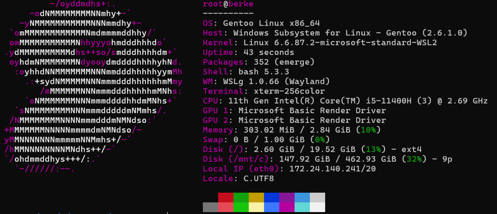

# Gentoo on WSL: Installation Notes and Troubleshooting



This repository documents the process of installing Gentoo Linux on Windows Subsystem for Linux (WSL). It specifically focuses on real-world errors encountered during the installation and their solutions, serving as a practical supplement to the official Gentoo Wiki (https://wiki.gentoo.org/wiki/Gentoo_in_WSL).

## Prerequisites

* Windows 10 or 11
* WSL2 enabled
* Windows Terminal

## Note
It is recommended to use current versions and use the updated download links at https://www.gentoo.org/downloads .

## Troubleshooting Log

### 1. PowerShell curl Alias Issue

When attempting to download the Stage3 tarball using PowerShell, the standard `curl` command fails because PowerShell aliases `curl` to `Invoke-WebRequest`, which does not support the same flags (specifically `-L`).

**Error:**
`Invoke-WebRequest : A parameter cannot be found that matches parameter name 'L'.`

**Solution:**
Use the native PowerShell syntax or explicitly call `curl.exe`.

```powershell
Invoke-WebRequest -Uri "[https://distfiles.gentoo.org/releases/amd64/autobuilds/current-stage3-amd64-openrc/stage3-amd64-openrc-20251012T210603Z.tar.xz](https://distfiles.gentoo.org/releases/amd64/autobuilds/current-stage3-amd64-openrc/stage3-amd64-openrc-20251012T210603Z.tar.xz)" -OutFile C:\wsl\gentoo\stage3.tar.xz
````

### 2\. Package Category Confusion

Gentoo Portage requires specific categories for packages. Finding these can be challenging during a fresh install. Below are the corrections for common tools encountered during this setup.

**Git:**

  * Incorrect assumption: `sys-devel/git`
  * Correct category: `dev-vcs/git`

**Strace:**

  * Incorrect assumptions: `dev-util/strace`, `sys-process/strace`
  * Correct category: `dev-debug/strace`

**Tip:** Use `emerge --search <package_name>` to identify the correct category if a package is not found.

### 3\. Sudo Configuration

After installing `app-admin/sudo`, the standard user cannot execute administrative commands immediately. The user must be added to the sudoers file.

**Steps:**

1.  Log in as root.
2.  Run `visudo`.
3.  Uncomment the following line to grant permissions to the 'wheel' group:

<!-- end list -->

```text
%wheel ALL=(ALL:ALL) ALL
```

## Successful Installation Command

The following command successfully installs the essential system tools, development utilities, and network analyzers with their correct categories (verified as of late 2025):

```bash
emerge --ask --verbose \
    app-admin/sudo \
    app-editors/vim \
    net-misc/wget \
    net-misc/curl \
    sys-process/htop \
    app-portage/gentoolkit \
    sys-apps/mlocate \
    app-shells/bash-completion \
    app-misc/fastfetch \
    dev-vcs/git \
    dev-debug/strace \
    net-misc/openssh
    net-analyzer/tcpdump
```

## Post-Installation Cleanup

To maintain a small WSL disk image size, it is good practice to remove unused dependencies and source files after the installation:

```bash
emerge -av --depclean
eclean-dist
```

## Setting Default User

By default, imported WSL distributions log in as `root`. To configure WSL to use your standard user account by default, run the following command in **Windows PowerShell**:

```powershell
Get-Item "HKCU:\Software\Microsoft\Windows\CurrentVersion\Lxss\*\DistributionName" | Where-Object { $_.GetValue("") -eq "Gentoo" } | Set-ItemProperty -Name "DefaultUid" -Value 1000
```

## License

This project is licensed under the MIT License.
